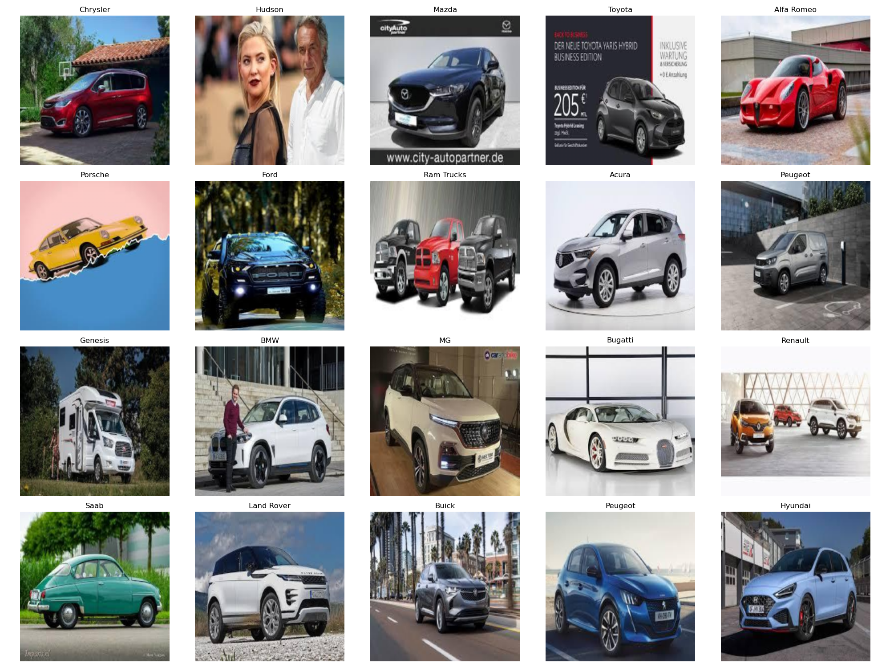
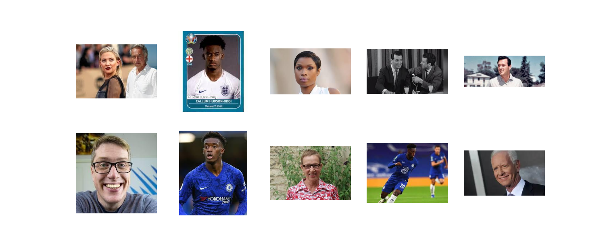
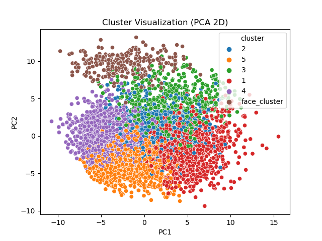

# 50 Car Brand Image Classifier Using Multiple CNNs

A deep‑learning project aimed at classifying **50 different car brands** in real‑world photographs. The project illustrates how data curation + transfer learning can turn a small, noisy dataset into a competitive image classifier.

## 1. Project Motivation
Car brand recognition powers applications ranging from automated insurance claims and smart traffic analytics to dealership inventory management. Real‑world images are messy, so this project focuses on cleaning the data first. With 50 brands, noisy labels, and real-world images, this dataset presents a challenging, multi-class classification problem that’s ideal for exploring deep learning techniques.

## 2. Dataset
- Source: [Kaggle – 100 images of top 50 car brands](https://www.kaggle.com/datasets/yamaerenay/100-images-of-top-50-car-brands?select=companies.csv)  
- Total Images: 4,598 across 50 car brands ≈ 100 per brand  
- Challenges:
    - High intra‑class variance (angles, lighting, backgrounds).
    - Severe label noise: non‑car images e.g. “Hudson” folder include photos of people named Hudson instead of cars.

Here's a 4×5 grid of 20 randomly selected car-brand images from the original dataset:


To download the data:
- Run the helper script (recommended):
```bash
bash scripts/download_data.sh
```
- Or manually download the dataset from Kaggle and extract it into the data/ folder.

## 3. Methodology
### 3.1. Filtering and Preprocessing
- Unsupervised Clustering for Facial Image Recognition
    - Used a pretrained model (e.g., from ResNet50’s penultimate layer) to extract each image **feature embeddings**.
    - Used **PCA** to reduced embeddings dimensionality to 50 components for faster clustering.
    - Performed **K-Means clustering** on the reduced embeddings, experimenting with different numbers of clusters (optimal around K ≈ 5–6).
    - Manually inspected the resulting clusters to identify and filter out groups containing non-car images or misclassified brand images.
<div style="display: flex; gap: 10px;">
  
  
</div>

- Car vs Non-Car Filtering Using Pretrained Labels
    - Used a ResNet50 model pretrained on ImageNet to predict the top label for each image.
    - For each image:
      1. Passed it through ResNet50 to obtain the highest-probability label.
      2. Checked if the predicted label matched any of the car-related keywords.
      3. Labeled images as noise if their predicted label did not correspond to a car category.

### 3.2. Model Training 

After cleaning the dataset, the final classification model is trained using a deep CNN:
- Architecture: **ResNet50** pretrained on ImageNet; replace FC layer with a 50‑unit head.
- Loss / Optimizer: Cross‑entropy, AdamW, cyclic LR.
- Data Augmentation: Random crop, horizontal flip, color jitter.
- Split: 70 % train · 15 % val · 15 % test (stratified by brand).

## 4. Results

## Roadmap
